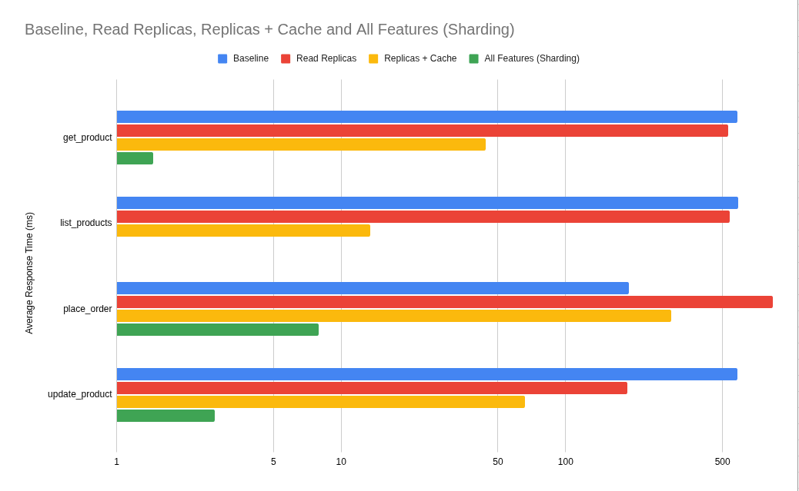
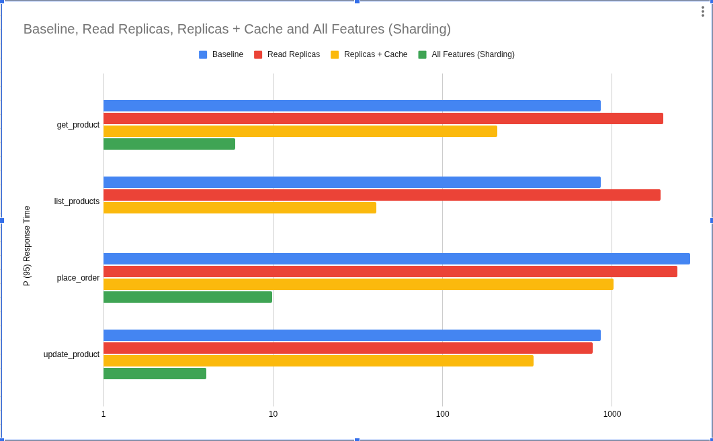

# Benchmark Results

**Endpoint:** `GET /products/:id`
**Tool:** k6 v1.6.1, constant-arrival-rate executor
**Dataset:** 100,000 seeded products

---

## Results Summary

| Run | Load | Access pattern | p(95) | vs Baseline |
|---|---|---|---|---|
| Baseline | 300/s | uniform random | 5.41ms | — |
| Redis cache | 300/s | uniform random | 6.1ms | +13% |
| Read replicas | 300/s | uniform random | 5.98ms | +11% |
| Baseline | 900/s | uniform random | 9.45ms | — |
| Redis cache | 900/s | uniform random | 9.26ms | -2% |
| Read replicas | 900/s | uniform random | 97.52ms | +931% |
| Replicas + Redis | 900/s | uniform random | 24.62ms | +160% |
| Replicas + Redis | 1000/s | 80/20 hot-key | 5.55ms | -41% vs 900/s baseline |
| Replicas + Redis | 2000/s | 80/20 hot-key | 6.19ms | -35% vs 900/s baseline |
| Replicas + Redis | 5000/s + 1000/s list | 80/20 hot-key | 7.29ms / 929µs | 71/600 VUs used |

---

## Round 1 — 300 req/s

Neither feature helped. The primary was under no pressure (~1.5/10 pooled connections in use) — no bottleneck to relieve.

- **Redis:** ~9% hit rate (9k requests / 100k IDs). 91% of requests paid Redis GET + DB + Redis SET instead of just DB. Net negative.
- **Replicas:** +0.5ms Docker inter-container overhead with nothing to offset it.

---

## Round 2 — 900 req/s, uniform random

| Metric | Baseline | Redis | Replicas | Replicas + Redis |
|---|---|---|---|---|
| p(95) | 9.45ms | 9.26ms | 97.52ms | 24.62ms |
| med | 6.72ms | 6.09ms | 21.67ms | 8.37ms |
| Dropped | 0 | 0 | 39 | 4 |

### Redis — marginal gain

Hit rate climbed to ~27% (27k requests / 100k IDs). Cache hits return in ~70µs vs ~7ms from DB. Two effects compound:
1. Cache hits bypass DB entirely
2. **Load shedding**: 27% fewer DB queries reduce contention, making cache misses faster too

p(95) improved only -2% because uniform random access is the worst case for a cache — the other 73% still hit the DB.

### Read replicas — pool saturation cascade

p(95) degraded 10x. Each replica pool was `max: 10`. At 450 req/s per replica:

1. WAL replay (streaming replication) competes with query execution for CPU/IO — replicas run slower than primary
2. Slower queries hold connections longer → pool exhausts
3. New requests queue for a free connection → latency climbs → more connections held → deeper queue

Primary never hit this: consistent ~5ms kept pool usage at ~4.5/10. VUs climbing to 78 (vs 14 baseline) confirmed the server was falling behind.

**Replicas + Redis:** cache hit rate reduced replica load by ~27%, enough to break the saturation loop. p(95) recovered from 97ms to 24ms — still worse than Redis alone because cache misses still route to slower replicas.

---

## Round 3 — 1000 req/s, 80/20 hot-key + optimisations

**Features: Read replicas + Redis cache both enabled.** Three changes applied before this run:

1. **80/20 access pattern** — 80% of traffic targets top 200 product IDs, 20% uniform random
2. **Async cache writes** — `SET` on cache miss is fire-and-forget (`.catch` for errors); response returns as soon as DB result is ready, no longer blocked by Redis round-trip
3. **Replica pool** — increased `max: 10 → 50` per replica

| Metric | get_product (900→1000/s) | list_products (100/s, paged) |
|---|---|---|
| med | 120µs | 149µs |
| p(90) | 5.27ms | 228µs |
| p(95) | 5.55ms | 264µs |
| Dropped | 24 | 0 |
| Error rate | 0% | 0% |

### Cache hit rate under 80/20

80% of `get_product` traffic targets 200 IDs. At 600s TTL those keys warm in the first second and stay warm for the entire 30s run. Effective hit rate ~80% vs ~27% under uniform random.

The bimodal distribution is visible in the numbers: **med = 120µs** (Redis hit) vs **p(95) = 5.55ms** (DB miss). The gap between them is the cost of a Postgres round-trip.

### list_products — near-total cache coverage

100 req/s across 50 distinct page keys (`offset` 0–1470, `limit` 30). At 600s TTL all 50 keys warm within the first second. **p(95) = 264µs** — effectively every request is a cache hit. This is the ceiling for what Redis cache-aside can deliver on a listing endpoint.

### Async cache writes

Removing `await` from the cache `SET` path means the response no longer blocks on the Redis round-trip after a DB miss. Effect is most visible at the median and average — tail latency (p(95)) is dominated by the DB query time regardless.

---

## Round 4 — 2000 req/s get_product, 500 req/s list_products

**Features: Read replicas + Redis cache both enabled.** Same config as Round 3 (80/20 hot-key, async writes). Load doubled on both scenarios.

| Metric | get_product 1000/s | get_product 2000/s | list_products 100/s | list_products 500/s |
|---|---|---|---|---|
| med | 120µs | 166µs | 149µs | 176µs |
| p(90) | 5.27ms | 5.45ms | 228µs | 280µs |
| p(95) | 5.55ms | 6.19ms | 264µs | 329µs |
| Dropped | 24 | 194 | 0 | — |
| Error rate | 0% | 0% | 0% | 0% |

### Observations

**Cache is absorbing the load.** Doubling get_product from 1000/s to 2000/s moved p(95) only +11% (5.55ms → 6.19ms). The hot 200 keys are still served from Redis for ~80% of requests. Median climbed 120µs → 166µs — the hot keys are seeing marginally more contention under 2x volume but the cache layer is holding.

**list_products scales nearly linearly.** 5x load increase (100/s → 500/s) with only +25% on p(95) (264µs → 329µs). 50 page keys at 600s TTL means cache hit rate stays at ~100% regardless of req/s — the bottleneck would be Redis throughput, not the DB.

**194 dropped iterations** — VUs hit the 202 ceiling (maxVUs=200). The server wasn't failing; k6 ran out of pre-allocated virtual users to fire requests. Not a server-side failure — a benchmark config ceiling.

**Throughput: 2493 req/s sustained**, 112 MB received.

---

## Round 5 — 5000 req/s get_product, 1000 req/s list_products (ceiling test)

**Features: Read replicas + Redis cache both enabled.** maxVUs raised to 400/200. Load 2.5x over Round 4.

| Metric | get_product 2000/s | get_product 5000/s | list_products 500/s | list_products 1000/s |
|---|---|---|---|---|
| med | 166µs | 245µs | 176µs | 242µs |
| p(90) | 5.45ms | 5.46ms | 280µs | 492µs |
| p(95) | 6.19ms | 7.29ms | 329µs | 929µs |
| max | 411ms | 49ms | 211ms | 8.5ms |
| Dropped | 194 | 11 | — | — |
| VUs used | 202 (hit ceiling) | 71 / 600 | — | — |

### The VU number tells the real story

At 6000 total req/s the server only needed **71 concurrent VUs** out of 600 available. Little's Law explains it:

```
VUs needed = throughput × avg_response_time
           = 6000 req/s × 0.00104s = ~6.2 concurrent connections on average
```

71 VUs at peak accounts for variance and burst — but the system had 8x headroom. The Round 4 VU saturation (202 VUs at 2000/s) was a k6 config problem (`maxVUs: 200` too low), not server saturation.

**list_products stays sub-millisecond at 1000 req/s** (p(95) = 929µs). 50 cached page keys, 600s TTL — hit rate stays ~100% regardless of req/s. The only constraint is Redis network round-trip.

**get_product p(90) barely moved** (5.45ms → 5.46ms) despite 2.5x load. The 80% Redis-served hot keys are insensitive to throughput. p(95) crept up because the cold 20% (DB path) sees marginally more queue time at 5000/s.

**Replicas + Redis: Round 2 vs Round 5.** Same feature combination, different result:

| | Round 2 | Round 5 |
|---|---|---|
| Load | 900/s | 5000/s |
| p(95) | 24.62ms | 7.29ms |
| Pool | max: 10 | max: 50 |
| Access | uniform random | 80/20 hot-key |
| Cache writes | synchronous | async (fire-and-forget) |

Three compounding changes turned a degraded result into the best one in the suite. The pool fix prevented the saturation cascade; the 80/20 pattern reduced replica DB load by ~80%; async writes removed the SET overhead from the response path.

**11 dropped iterations** out of 179,992 (0.006%) — noise. The server is not approaching its limit.

### Where the actual ceiling is

The local setup constraints at this point are: Node.js single-threaded event loop, local container networking latency, and the laptop's CPU. The DB and Redis are not the bottleneck — the cache is absorbing ~80% of get_product load and ~100% of list load. To find the real server ceiling, the next variable to change is horizontal scaling (multiple Node.js processes) or moving off local Docker.

---

---

---

# Suite 2 — Mixed Read/Write Load (Validating Read Replicas)

**New scenario added:** `update_product` at 200/s targeting IDs 201–1200 (outside hot read pool).
**Goal:** demonstrate read replica value under real write pressure.

## Suite 2 Summary

| Run | get p(95) | list p(95) | update p(95) | Dropped | Avg VUs |
|---|---|---|---|---|---|
| Baseline | 684ms | 679ms | 679ms | 136,007 | 676 |
| Redis cache | 468ms | 587ms | 684ms | 6,566 | 13 |
| Redis + Replicas | 13.48ms | 7.91ms | 9.42ms | 814 | 15 |

---

## Suite 2 — Round 1: Baseline (no replicas, no cache)

**Load:** get_product 5000/s + list_products 1000/s + update_product 200/s

| Metric | get_product | list_products | update_product |
|---|---|---|---|
| med | 407ms | 400ms | 404ms |
| p(95) | 684ms | 679ms | 679ms |

**Dropped: 136,007 / ~186k. VUs: 676/700.**

All three scenarios share the same primary pool. Writes hold connections longer (WAL flush); reads queue behind them. The ~400ms median across all scenarios is connection wait time, not query time — the pool is exhausted. 136k dropped iterations confirm the server fell behind immediately.

---

## Suite 2 — Round 2: Redis cache (no replicas)

**Load:** get_product 5000/s + list_products 1000/s + update_product 200/s

| Metric | get_product | list_products | update_product |
|---|---|---|---|
| med | 755µs | 1.21ms | 258ms |
| p(95) | 468ms | 587ms | 684ms |

**Dropped: 6,566. Avg VUs: 13.**

Cache absorbed ~80% of read load — VUs collapsed from 676 to 13. `get_product` med (755µs) vs p(95) (468ms) shows the bimodal split: hot cache hits vs cold misses hitting the DB. `update_product` p(95) is unchanged at 684ms — writes bypass cache and still compete with cold reads on the primary. That remaining tail is what replicas should fix.

---

## Suite 2 — Round 3: Redis + Read replicas

**Load:** get_product 5000/s + list_products 1000/s + update_product 200/s

| Metric | get_product | list_products | update_product |
|---|---|---|---|
| med | 812µs | 805µs | 2.64ms |
| p(95) | 13.48ms | 7.91ms | 9.42ms |

**Dropped: 814. Avg VUs: 15. All thresholds passed. ✅**

The `update_product` result is the signal: p(95) dropped from 684ms (Redis-only) to 9.42ms. Reads are now off the primary — replicas handle cold read misses, leaving the primary exclusively for writes. Cache + replicas are complementary: cache eliminates ~80% of reads entirely, replicas absorb the remaining 20%, primary handles writes uncontested.

---

## Key takeaways

| Finding | Detail |
|---|---|
| Cache benefit scales with hit rate | 9% hit rate → Redis hurts. 27% → marginal gain. 80% → -41% p(95) |
| Replicas are a write-offload tool | Benefit only visible under concurrent write pressure on the primary |
| Pool saturation is a cascade | One slow query holds a connection; exhausted pool queues everything |
| Async cache writes reduce avg/med | p(95) still floor'd by DB query time on misses |
| Uniform random is a worst-case cache test | Real traffic has hot keys — always benchmark with a realistic distribution |
| Cache scales better than the DB under hot-key load | 2x req/s → +11% p(95). DB-only would scale linearly or worse. |
| Dropped iterations ≠ server failure | VU ceiling hit first — distinguish k6 config limits from actual server degradation |
| VU count reveals headroom | 71 VUs at 6000 req/s = 8x headroom. Little's Law: VUs ≈ throughput × avg_latency |
| list cache is throughput-insensitive | 50 keys, 600s TTL — hit rate stays ~100% from 100/s to 1000/s. Ceiling is Redis RTT. |

---

## Hot Standby Conflict Issue

### What happened

Running read replicas initially produced errors on the replica nodes:

```
ERROR: canceling statement due to conflict with recovery
```

These appeared under the default PostgreSQL hot standby configuration and caused queries to be aborted mid-flight.

### Root cause

PostgreSQL streaming replication works by continuously replaying WAL (Write-Ahead Log) records from the primary. When the primary runs VACUUM or UPDATE on rows that a replica query is currently reading, a conflict arises: the replica cannot apply the WAL record without potentially invalidating the in-progress query's snapshot.

By default PostgreSQL resolves this conflict in favour of replication — it cancels the replica query immediately. This is correct behaviour for replicas meant to stay in sync, but it makes them unreliable as a read target under any write load.

### Fix: `hot_standby_feedback`

Two parameters were added to the replica startup in `docker/pg-replica/entrypoint.sh`:

```bash
exec gosu postgres postgres \
  -c hot_standby_feedback=on \
  -c max_standby_streaming_delay=30s
```

**`hot_standby_feedback=on`** — The replica sends the primary a heartbeat with its oldest active transaction XID. The primary uses this to delay vacuuming rows that the replica is still reading. This is the primary fix: it prevents the conflict from arising in the first place.

**`max_standby_streaming_delay=30s`** — If a conflict does occur despite the above (e.g. a long-running replica query vs. a large bulk update), the replica waits up to 30 seconds before canceling the query instead of failing immediately. Makes behaviour more predictable and less brittle under burst write loads.

### Trade-offs

| Trade-off | Detail |
|---|---|
| Vacuum delay on primary | `hot_standby_feedback` can cause the primary to retain dead row versions longer than it otherwise would. Under heavy read load on replicas, this inflates table bloat on the primary. If replica queries are long-running, dead tuples accumulate. |
| Replication lag tolerance | `max_standby_streaming_delay` allows the replica to fall slightly further behind the primary to protect in-flight queries. Under heavy sustained write load the replica may lag more than without this setting. |
| Not a free lunch | These settings trade replication aggressiveness for query reliability. For reporting replicas (long queries) the trade-off is clearly worth it. For replicas under tight RPO requirements (disaster recovery, near-zero lag), you'd want to tune these conservatively or keep `hot_standby_feedback` off. |
| Application-level mitigation | The db_router already has a fallback: if a replica query fails, it retries on the primary. `hot_standby_feedback` reduces how often that fallback fires but the safety net remains. |

### Interview talking point

> "Read replicas in hot standby mode can cancel queries when WAL replay conflicts with active snapshots. The default behaviour favours replication consistency over query availability. `hot_standby_feedback` inverts that priority: the replica tells the primary 'don't vacuum these rows yet, I'm still reading them.' The cost is slightly higher table bloat on the primary. For a read-scaling use case the trade-off is correct — query reliability matters more than vacuum aggressiveness. For a replica used as a failover standby with a tight RPO, you'd think twice."

---

---

---

# Suite 3 — Sharding (Write Distribution Across Two Shards)

**Architecture change:** Products and SKUs are now sharded by `store_id % 2`. Shard-1 (port 5435) holds even store IDs; Shard-2 (port 5436) holds odd store IDs. Each shard has its own replica (5437/5438). The main primary is now dedicated to orders and users only.

**Routes changed to store-scoped:**
- `GET /stores/:storeId/products/` — list products for a store
- `GET /stores/:storeId/products/:productId` — get product (routes to correct shard)
- `PUT /stores/:storeId/products/:productId` — update product (routes to correct shard write)
- `POST /stores/:storeId/orders` — place order (Redlock + 2-phase commit: shard tx + primary tx)

**New scenario added:** `place_order` at 50/s — Redlock acquires per-user + per-SKU locks in Redis, then executes a 2-phase commit: decrement SKU supply on the shard, create order record on the primary. 409 on lock contention (Redlock retries exhausted).

**Goal:** Validate two hypotheses:
1. Sharding routes product writes to independent shard primaries, leaving the main primary uncontested for order writes.
2. Measure the overhead of distributed transactions (Redlock + cross-node 2-phase commit) at moderate order rates.

**k6 scenario pools:**
- `get_product`: 80/20 hot-key — products 1–200 (stores 1–20), 20% uniform random
- `list_products`: stores 1–50, limit=30 — cache warms within first second, ~100% hit rate
- `update_product`: products 1201–2200 (stores 121–220) — separated from hot read pool
- `place_order`: products 2201–6200 (stores 221–620, 12 000 SKUs) — large pool keeps per-SKU lock contention low at 50/s

---

## Suite 3 Summary

| Run | get p(95) | list p(95) | update p(95) | order p(95) | Dropped | Avg VUs |
|---|---|---|---|---|---|---|
| Baseline (no features) | 858ms ❌ | 856ms ✅ | 858ms ❌ | 2.89s ❌ | 151,038 | 746 (maxed) |
| Read Replicas only | 2s ❌ | 1.93s ❌ | 764ms ❌ | 2.42s ❌ | 149,053 | 750 (maxed) |
| Redis + Read Replicas | 209ms ✅ | 40ms ✅ | 344ms ✅ | 1.02s ❌ | 7,099 | 194 |
| Redis + Replicas + Sharding | 5.96ms ✅ | 794µs ✅ | 4.05ms ✅ | 9.91ms ✅ | 542 | 8 |

Charts below use a **logarithmic scale** — the All Features bars would be invisible on a linear scale.




---

## Suite 3 — Round 1: Baseline (no features)

**Load:** get_product 5000/s + list_products 1000/s + update_product 200/s + place_order 50/s
**Features:** none

| Metric | get_product | list_products | update_product | place_order |
|---|---|---|---|---|
| med | 559ms | 560ms | 557ms | 2.31s |
| p(90) | 775ms | 777ms | 771ms | 2.72s |
| p(95) | 858ms ❌ | 856ms ✅ | 858ms ❌ | 2.89s ❌ |

**Dropped: 151,038 / ~187k (81%). VUs: 746/750 maxed.**

The primary pool is `max: 10`. At 6,250 req/s those 10 connections are immediately exhausted — the ~560ms median is queue wait, not query time. `place_order` is worse because each order holds a connection for Redlock + 2-phase commit on top of the read flood. `list_products` technically passes its 1s threshold but the underlying numbers are identical to the other scenarios.

---

## Suite 3 — Round 2: Read Replicas only (no cache, no sharding)

**Load:** get_product 5000/s + list_products 1000/s + update_product 200/s + place_order 50/s
**Features:** `FEATURE_READ_REPLICAS=true`

| Metric | get_product | list_products | update_product | place_order |
|---|---|---|---|---|
| med | 247ms | 271ms | 75ms | 635ms |
| p(90) | 1.36s | 1.43s | 616ms | 1.86s |
| p(95) | 2s ❌ | 1.93s ❌ | 764ms ❌ | 2.42s ❌ |

**Dropped: 149,053 / ~187k (80%). VUs: 750/750 maxed.**

Worse than baseline. Replicas move reads off the primary but don't reduce query volume — every request still generates a DB round-trip. WAL replay competes with query execution on the replicas, so each query is slower than on the primary. Slower queries hold connections longer, latency climbs, and the drop rate stays at 80%. Replicas are a write-offload tool — without cache cutting query volume first, adding them just moves the problem.

---

## Suite 3 — Round 3: Redis + Read Replicas (no sharding)

**Load:** get_product 5000/s + list_products 1000/s + update_product 200/s + place_order 50/s
**Features:** `FEATURE_READ_REPLICAS=true FEATURE_REDIS_CACHE=true`

| Metric | get_product | list_products | update_product | place_order |
|---|---|---|---|---|
| med | 9.24ms | 6.71ms | 17.86ms | 136ms |
| p(90) | 92.37ms | 28.27ms | 186.56ms | 821ms |
| p(95) | 209ms ✅ | 40ms ✅ | 344ms ✅ | 1.02s ❌ |

**Dropped: 7,099. VUs: avg 194, max 485.**

Cache absorbs ~80% of `get_product` — hot 200 keys warm in the first second, served from Redis in ~70µs. DB query volume drops enough that replicas stop saturating and VUs fall from 750 to 194. `list_products` at 40ms shows near-total cache coverage on 50 page keys.

`place_order` misses by 20ms. It doesn't benefit from cache — it's a write. At 50 orders/s, each order holds a primary connection for Redlock + 2-phase commit while competing with `update_product` writes. That contention is what sharding fixes.

---

## Suite 3 — Round 4: Redis + Replicas + Sharding

**Load:** get_product 5000/s + list_products 1000/s + update_product 200/s + place_order 50/s
**Features:** `FEATURE_READ_REPLICAS=true FEATURE_REDIS_CACHE=true FEATURE_SHARDING=true`

| Metric | get_product | list_products | update_product | place_order |
|---|---|---|---|---|
| med | 250µs | 226µs | 1.96ms | 6.2ms |
| p(90) | 4.66ms | 560µs | 3.21ms | 7.81ms |
| p(95) | 5.96ms ✅ | 794µs ✅ | 4.05ms ✅ | 9.91ms ✅ |

**Dropped: 542. VUs: avg 8, max 14. All thresholds passed. Checks: 100%. ✅**
**Throughput: 6,230 req/s sustained.**

All four pass. `update_product` now routes to shard primaries, so the main primary handles only order writes. With no competing writes, `place_order` median drops from 136ms to 6.2ms. The avg VU count of 8 at 6,250 req/s means the server is never backlogged — requests complete before new ones pile up.

| Layer | Bottleneck removed | place_order p(95) | get p(95) |
|---|---|---|---|
| Baseline | — | 2.89s | 858ms |
| + Read Replicas | nothing — same query volume | 2.42s | 2s |
| + Redis Cache | ~80% of reads eliminated | 1.02s | 209ms |
| + Sharding | primary write contention | **9.91ms** | **5.96ms** |

---

## Suite 3 Key Takeaways

| Finding | Detail |
|---|---|
| Replicas need cache first | Without cache, replicas don't reduce query volume — they just move it. Made things worse here. |
| Cache eliminates load, not just speeds it up | 80% of get_product never hit the DB. That's what made replicas viable. |
| Sharding isolates write paths | Product writes on shard primaries freed the main primary for orders. place_order p(95): 1.02s → 9.91ms. |
| VU count is the best health signal | 8 avg VUs at 6250 req/s = server is never backlogged. 750 VUs at the same load = it can't keep up. |
| Distributed transactions are cheap when uncontested | Redlock + 2-phase commit ran in 6.2ms median once the primary had no competing writes. Contention was the cost, not the mechanism. |
